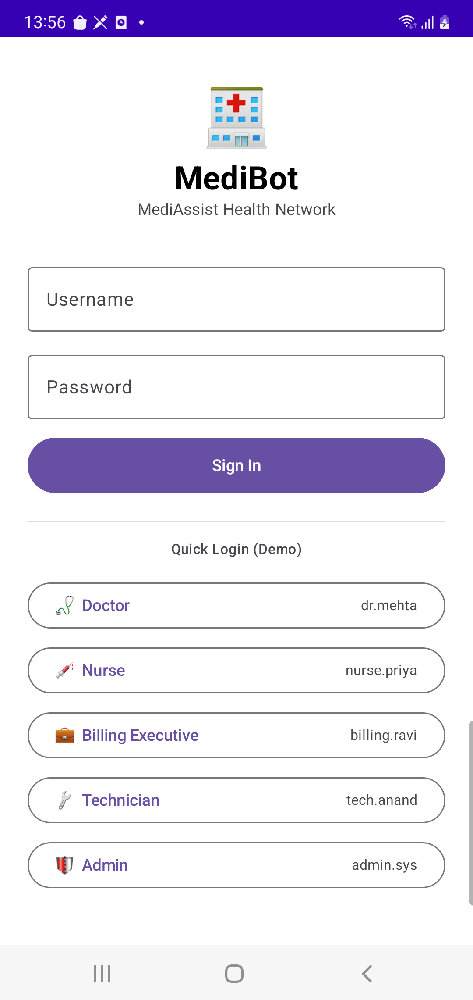
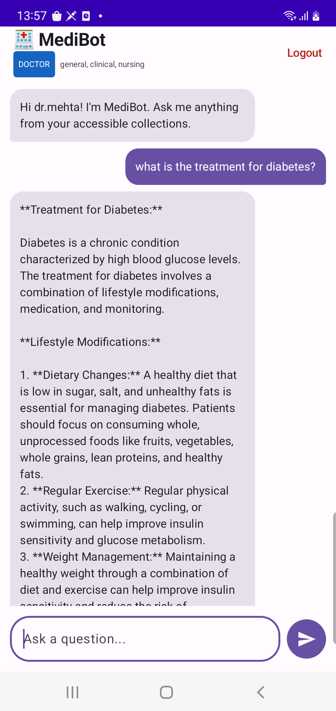

# MediAssist ChatBot App

MediAssist is an Android application designed to provide medical assistance and information using a RAG (Retrieval-Augmented Generation) based chatbot system. It connects to a FastAPI backend to deliver intelligent, context-aware responses.

## 📱 Screenshots

| Login Screen | Chat Interface |
|--------------|----------------|
|  |  |

*(Note: Create a folder named `screenshots` in your root directory and add your images there.)*

## ✨ Features

- **Secure Login**: JWT-based authentication to protect user data.
- **Intelligent Chatbot**: Powered by a FastAPI backend using RAG for accurate medical information.
- **Role-Based Access**: Specialized collections based on user roles.
- **Modern UI**: Built entirely with Jetpack Compose for a smooth and responsive experience.
- **Offline Storage**: Uses DataStore to securely manage authentication tokens.

## 🛠️ Tech Stack

- **Frontend**: Kotlin, Jetpack Compose, Material 3
- **Networking**: Retrofit, OkHttp
- **Architecture**: MVVM (Model-View-ViewModel)
- **Backend**: FastAPI (Python)
- **Dependency Management**: Gradle Version Catalog (libs.versions.toml)

## 🚀 Getting Started

1. **Clone the repository**:
   ```bash
   git clone https://github.com/YOUR_USERNAME/MediAssistChatBotApp.git
   ```
2. **Setup the Backend**: Ensure your FastAPI server is running.
3. **Configure the App**: Update the `BASE_URL` in `RetrofitClient.kt` to match your server's IP address.
4. **Build & Run**: Open the project in Android Studio and run it on your device or emulator.

---
Developed as a medical assistance tool to bridge the gap between users and reliable health information.
